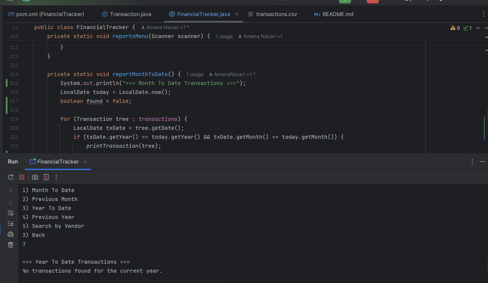
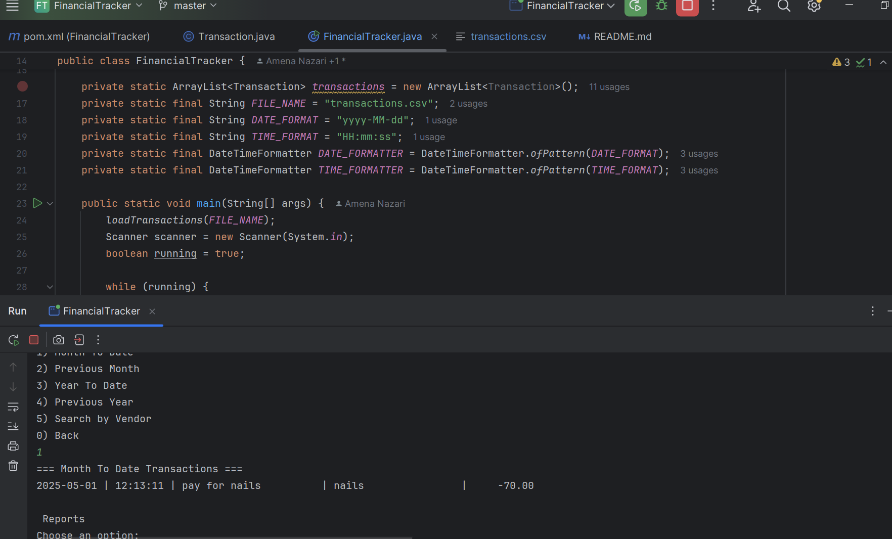
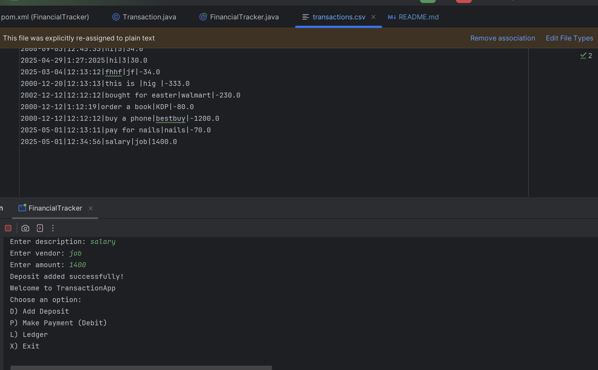
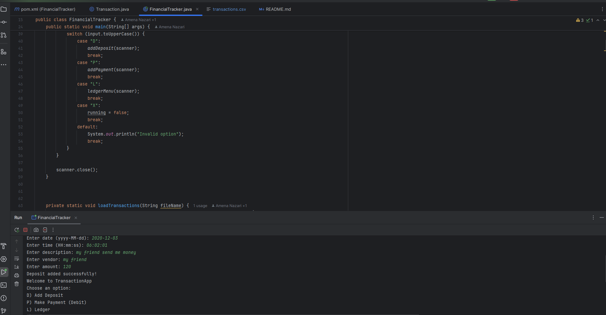

# Financial Tracker Application 

## Description of the Project

This Java console-based application is a Financial Tracker designed to help users record, view, and manage their financial transactions such as deposits and payments. It provides a simple, interactive command-line interface for inputting transaction details (date, time, vendor, description, amount) and saving them persistently to a file.

The core purpose of the application is to assist individuals—especially students, freelancers, or anyone managing personal finances—in keeping track of where their money goes and when. 

The application supports:

Adding new deposits (positive amounts) and payments (negative amounts)

Displaying a complete ledger or filtering by deposits/payments

Generating reports (Month-to-Date, Previous Month, Year-to-Date, Previous Year)

Searching for transactions by vendor name

## User Stories

- As a user, I want to be able to input my data, so that the application can process it accordingly.
- As a user, I want to receive immediate feedback, so I can understand what to do next.
- As a user, I want to view reports for specific time periods, so I can analyze my finances.
- As a user, I want to search by vendor, so I can track transactions more easily.

## Setup

Instructions on how to set up and run the project using IntelliJ IDEA.

### Prerequisites

IntelliJ IDEA: `[Download here](https://www.jetbrains.com/idea/)
Java SDK (Java 17 or later)

### Running the Application in IntelliJ

Follow these steps to get your application running within IntelliJ IDEA:

1. Open IntelliJ IDEA.
2. Select "Open" and navigate to the directory where you cloned or downloaded the project.
3. After the project opens, wait for IntelliJ to index the files and set up the project.
4. Find the main class with the `public static void main(String[] args)` method.
5. Right-click on the file and select 'Run 'YourMainClassName.main()'' to start the application.

## Technologies Used

Java – Version 17
No external libraries used (pure Java console app)

## Demo

[Application Screenshot](path/to/your/screenshot.png)

## Resources

List resources such as tutorials, articles, or documentation that helped you during the project.

- [W3 School](https://www.w3schools.com/java/java_date.asp)
- [visual Studio Code](https://code.visualstudio.com/docs/java/java-tutorial)
- [Apache NetBeans ](https://netbeans.apache.org/tutorial/main/kb/docs/java/javase-intro/)
- [CodeGym](https://codegym.cc/groups/posts/java-localdate-class)
- [Baedung](https://www.baeldung.com/java-creating-localdate-with-values)
- [Youtube](https://youtu.be/r59xYe3Vyks?feature=shared)
- [google](https://g.co/doodle/nsusqhf?kgs=d41d44cc31203456)
- [AI](https://chatgpt.com/?utm_source=google&utm_medium=paidsearch_nonbrand&utm_campaign=DEPT_SEM_Google_NonBrand_Acquisition_NAMER_US_Consumer_CPA_BAU_Generic-Mix&utm_term=ai&gad_source=1&gclid=EAIaIQobChMI89-tiuGCjQMV1sKfCR1CESOgEAAYASAAEgIhVPD_BwE)
## Team Members

Amena Nazari – Developer

## Thanks

Express gratitude towards those who provided help, guidance, or resources:

- Thank you to Maroun Raymond for continuous support and guidance.
- A special thanks to all teammates for their dedication and teamwork.
 