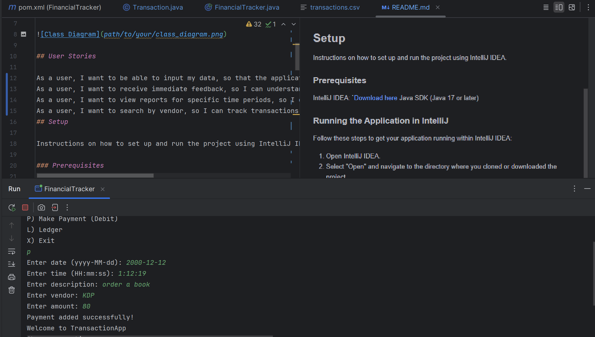

# Accounting Ledger Application

## Description of the Project

This application can track all financial
transactions for a business or for personal use.

## User Stories

As a user, I want to be able to input my data, so that the application can process it accordingly.
As a user, I want to receive immediate feedback, so I can understand what to do next.
As a user, I want to view reports for specific time periods, so I can analyze my finances.
As a user, I want to search by vendor, so I can track transactions more easily.
## Setup

Instructions on how to set up and run the project using IntelliJ IDEA.

### Prerequisites

IntelliJ IDEA: `[Download here](https://www.jetbrains.com/idea/)
Java SDK (Java 17 or later)

### Running the Application in IntelliJ

Follow these steps to get your application running within IntelliJ IDEA:

1. Open IntelliJ IDEA.
2. Select "Open" and navigate to the directory where you cloned or downloaded the project.
3. After the project opens, wait for IntelliJ to index the files and set up the project.
4. Find the main class with the `public static void main(String[] args)` method.
5. Right-click on the file and select 'Run 'YourMainClassName.main()'' to start the application.

## Technologies Used

Java – Version 17
No external libraries used (pure Java console app)

## Demo

[Application Screenshot](path/to/your/screenshot.png)

## Future Work

Java – Version 17
No external libraries used (pure Java console app)Add ability to delete/edit existing transactions
Support recurring payments or income
Implement a database instead of file-based storage
Export reports to CSV or PDF

## Resources

List resources such as tutorials, articles, or documentation that helped you during the project.

- [Youtube](https://youtu.be/r59xYe3Vyks?feature=shared)
- [google](https://g.co/doodle/nsusqhf?kgs=d41d44cc31203456)
- [AI](https://chatgpt.com/?utm_source=google&utm_medium=paidsearch_nonbrand&utm_campaign=DEPT_SEM_Google_NonBrand_Acquisition_NAMER_US_Consumer_CPA_BAU_Generic-Mix&utm_term=ai&gad_source=1&gclid=EAIaIQobChMI89-tiuGCjQMV1sKfCR1CESOgEAAYASAAEgIhVPD_BwE)

## Team Members

Amena Nazari – Developer
## Thanks

Express gratitude towards those who provided help, guidance, or resources:

- Thank you to Maroun Raymond for continuous support and guidance.
- A special thanks to all teammates for their dedication and teamwork.
 